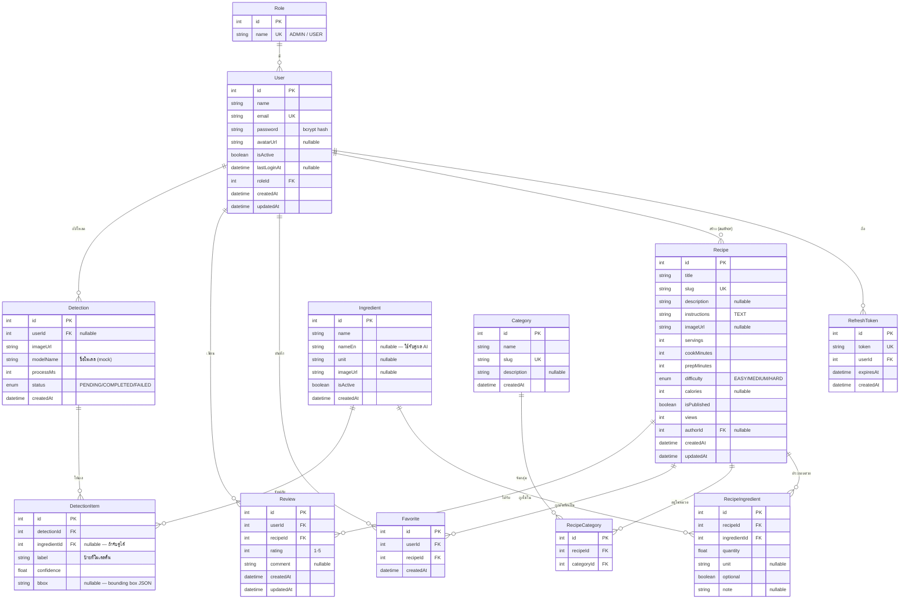

# 🗄 ER Diagram — Cooking Recipe Recommendation System

แผนผังความสัมพันธ์ของฐานข้อมูล (Prisma + PostgreSQL) แสดงด้วย Mermaid
สามารถดูภาพได้บน GitHub, VS Code (ติดตั้ง Mermaid extension) หรือ https://mermaid.live

## ความสัมพันธ์สำคัญ

- **User ↔ Role** — ผู้ใช้แต่ละคนมี 1 บทบาท (ADMIN หรือ USER)
- **Recipe ↔ Ingredient** — ความสัมพันธ์แบบ many-to-many ผ่าน `RecipeIngredient` (เก็บปริมาณ หน่วย และว่าเป็นวัตถุดิบเสริมหรือไม่)
- **Recipe ↔ Category** — many-to-many ผ่าน `RecipeCategory`
- **Favorite / Review** — เชื่อม User กับ Recipe (มี unique constraint กัน 1 user ต่อ 1 recipe)
- **Detection ↔ DetectionItem** — การอัปโหลดรูป 1 ครั้งให้ผลได้หลายวัตถุดิบ โดย `DetectionItem.ingredientId` จะถูกเติมเมื่อจับคู่ `label` (อังกฤษ) กับ `Ingredient.nameEn` ได้

## หมายเหตุการออกแบบเพื่อรองรับ AI จริง

ฟิลด์ `Ingredient.nameEn` และตาราง `Detection` / `DetectionItem` ถูกออกแบบไว้ล่วงหน้าเพื่อรองรับโมเดลตรวจจับจริง เมื่อสลับจาก mock เป็นโมเดลจริง โครงสร้างตารางไม่ต้องเปลี่ยน — เพียงแค่ผลลัพธ์ใน `DetectionItem` จะมาจากโมเดลจริงแทน
